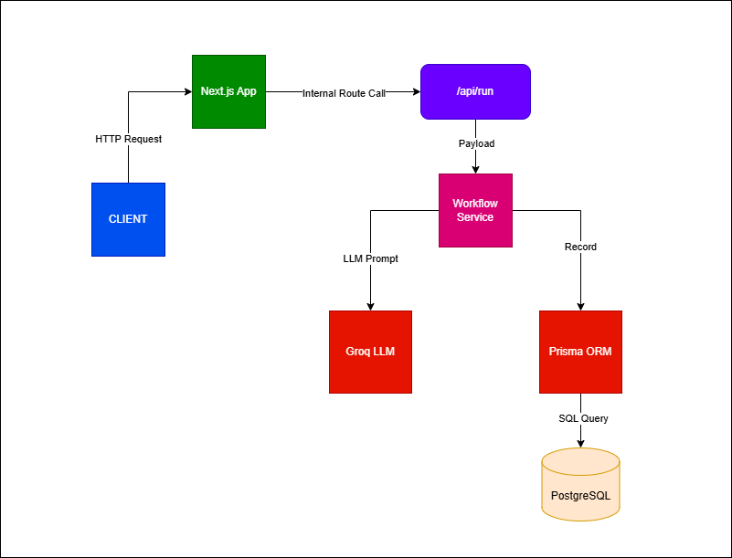

# Workflow Builder Lite

A type-safe, AI-powered text processing pipeline built with Next.js, Prisma, and Groq AI. Users can build structured workflows by chaining up to four AI processing steps in a custom sequence.

---

## Overview

- Workflow Builder Lite allows users to:
- Chain AI operations sequentially
- Process text through multiple transformation stages
- Persist execution history
- Monitor system health in real time

---

## Tech Stack

- **Framework**: Next.js
- **Language**: TypeScript
- **Database** ORM: Prisma
- **Database**: PostgreSQL / SQLite
- **AI Model**: Groq LLaMA 3.1 8B Instant
- **Styling**: Tailwind CSS

---

## Architecture

